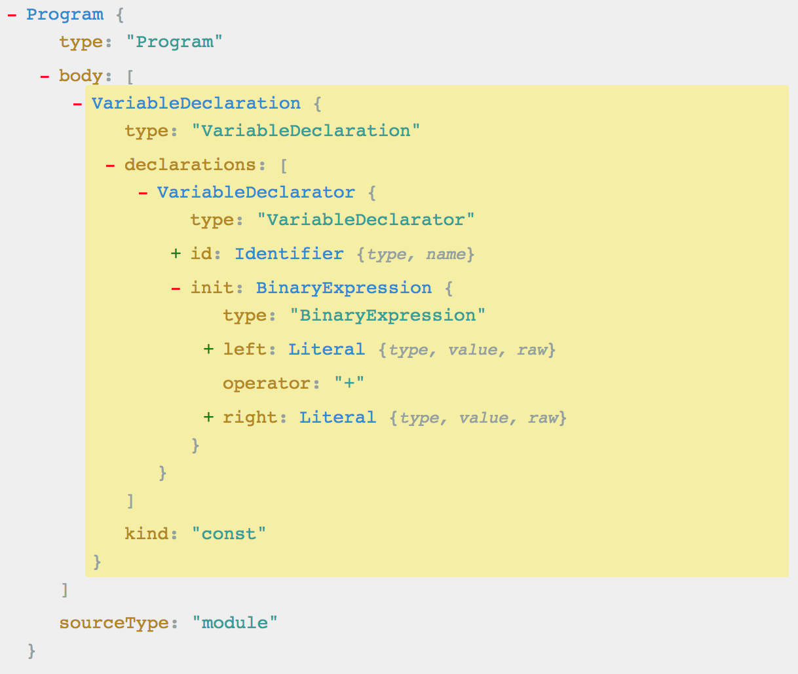

## 简易的babel 插件开发入门例子

主要做的事情是按需加载lodash库
将如下的代码
```javascript
import _ from 'lodash'
import isArray from 'lodash/isArray'
import { toString } from 'lodash'

isArray([])
_.add(1, 2)
toString(1)
_.add(1, 2)
isArray([1])
```
↓↓↓↓↓↓↓↓↓↓↓ 转换成如下的代码
```javascript
import isArray from 'lodash/isArray';
import toString from 'lodash/toString';

isArray([]);
import add from 'lodash/add';
add(1, 2)

toString(1);
add(1, 2)

isArray([1]);
```

# babel-plugin-lodash-extract
平常开发的时候有些同学会不遵守规范或者无意中使用了如下写法
```javascript
import _ from 'lodash'
或
import loadsh from 'lodash'
```
这样会把所有的lodash代码都加载进去
导致大概js文件大小会大70kb左右

如下代码
```javascript
import _ from 'lodash'

_.add(1, 2)

```
结果有71.1kb
```javascript
static/js/vendor.6b317cc799badf6ad864.js    71.1 kB       0  [emitted]  vendor
```

但是这么写的话
```javascript
import add from 'lodash/add'
add(1, 2)
```

发现只有这么大
```javascript
static/js/vendor.d9f1fb9269405aa51217.js    2.24 kB       0  [emitted]  vendor
```

### 下载安装 
``` javascript
npm i --save-dev babel-plugin-lodash-extract
```

#### 示例:  
在babel的配置文件里加上
```json
{
  "plugins": ["babel-plugin-lodash-extract"],
}
```
这样的配置，这里需要注意是plugins的加载顺序是从后往前的,一般的项目都有添加
transform-runtime插件,那么写法需要这样
```json
{
  "plugins": [
    "transform-runtime",
    "babel-plugin-lodash-extract"
  ],
}
```
### CLI
```javascript
  npm run test // unit test
  npm run debug // development debug
  npm run compile // development compile
  npm run example // run example
```

### 原理说明

首先根据babel的[插件开发文档](https://github.com/jamiebuilds/babel-handbook/blob/master/translations/en/plugin-handbook.md "Markdown")

发现所有的babel插件需要按照以下的格式来进行处理代码
```javascript
module.exports = ({ types: t }) => {
  return {
    visitor: {
      // ...some code
    },
  };
}
```
然后babel会把你的代码解析成AST

首先建立一个目录example，里面建两个文件index.js, example.js

下列使用这个代码来进行处理

// example.js的内容
```javascript
const a = 1 + 2;
```
↓↓↓↓↓↓↓↓
解析成
```javascript
const b = 2 - 3;
```
在这个网站https://astexplorer.net进行AST解析



观察一下这个语法树

首先进行变量a的替换
来看一下结果代码
```javascript
module.exports = ({ types: t }) => {
  return {
    visitor: {
      Identifier(path) {
        if (path.node.name === 'a') {
          path.replaceWith(t.Identifier('b'));
        }
      },
    },
  };
}

// 在package.json里面加入 "example": "babel --plugins ../example/index.js ./example/example.js"
// 运行 npm run example
// 输出 const b = 1 + 2;
```

然后继续解析 1 + 2 -> 2 - 3
```javascript
module.exports = ({ types: t }) => {
  return {
    visitor: {
      Identifier(path) {
        ...
      },
      BinaryExpression(path) {
        if (path.node.operator === '+') {
          const left = t.numericLiteral(2);
          const right = t.numericLiteral(3);
          path.replaceWith(t.binaryExpression('-', left, right));
        }
      }
    },
  };
}
// 输出 const b = 2 - 3;
// 目标完成
```
关于t上面有哪些方法可以根据__babel-types__的[文档](https://babeljs.io/docs/core-packages/babel-types/#binaryexpression "Markdown")来进行查阅

还有__path__的一些使用方法在[babel插件手册](https://github.com/jamiebuilds/babel-handbook/blob/master/translations/en/plugin-handbook.md "Markdown")里也有部分解释

#### 完整代码
```javascript
module.exports = ({ types: t }) => {
  return {
    visitor: {
      Identifier(path) {
        if (path.node.name === 'a') {
          path.replaceWith(t.Identifier('b'));
        }
      },
      BinaryExpression(path) {
        if (path.node.operator === '+') {
          const left = t.numericLiteral(2);
          const right = t.numericLiteral(3);
          path.replaceWith(t.binaryExpression('-', left, right));
        }
      }
    },
  };
}
```

#### 没了。
